# Scene Director — Free Distribution

Public distribution repository for **Scene Director**, a Foundry VTT module that plays cinematic screens for every player at once: when combat starts, when it ends and when a session opens, plus interactive maps the whole table explores together.

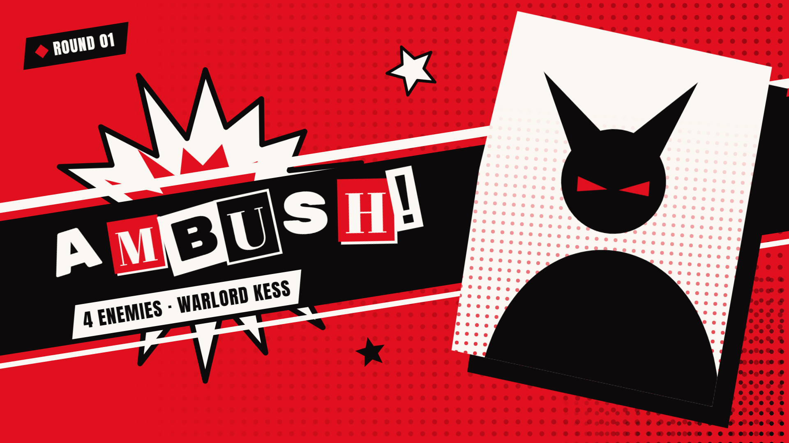

## Install

In Foundry, open **Add-on Modules → Install Module** and paste this manifest URL:

```text
https://github.com/LucasChlz/Scene-Director-Distribution/releases/latest/download/module.json
```

Requires Foundry VTT v13 (verified 13.351). Works with any game system.

Release assets contain only the Foundry runtime (`scripts`, `styles`, `lang`, `fonts`), `module.json`, `LICENSE`, `README.md` and `CHANGELOG.md`. Development files, tests and internal documentation are not included.

## Free features

- Encounter start and end screens in two art styles, **Rebel** and **Chronicle**, shown to the whole table at the same time.
- The combat fills them in: enemy leader, party members, names, enemy count and rounds. Hidden combatants never show; actors with no art get the style's silhouette.
- **Cast:** right-click a combatant to make it the leader, or open the Cast window to order the party and leave someone out.
- **Session openings:** click **Open session**, write the session number, the chapter and what happened last time, and an opening screen plays for everyone with the party.
- **Studio:** open any scene from the brush icon in the library, then move, stretch, turn and slant its layers on the stage, with snapping guides. Double click a title to rewrite it in place. Hide, lock, rename and reorder layers, undo and redo, zoom and preview in the same window.
- **Interactive maps and title cards:** your own map art with places the table hovers and clicks. A click opens another map, activates a Foundry scene, opens a journal or plays a cinematic, either led by the GM for everyone or free for each player. Hidden places stay off players' screens until the GM reveals them with a right-click. Put a map in a Foundry scene and whoever views the scene sees the map instead of the canvas and explores it alone, with Foundry's interface still on top. Title cards play for everyone when their Foundry scene is activated.
- Every color of every style is editable, with saved palettes, a default palette per style and a contrast warning.
- Editable texts (`{leader}`, `{enemies}`, `{roundsRoman}`…), fixed images for any slot, and a sound per scene. Images and sounds can be uploaded straight from your computer (button, drop or paste).
- A GM window that dresses in the style of the scene being edited, with a live preview you can zoom into (Ctrl + mouse wheel).
- Plays automatically when combat starts and ends, or on demand, from key bindings or the API.
- Screens last 2 to 4 seconds and can be skipped; each player can turn off flashes and camera shake.
- English and Brazilian Portuguese. Public API for new art styles, text treatments and kinds of screens.

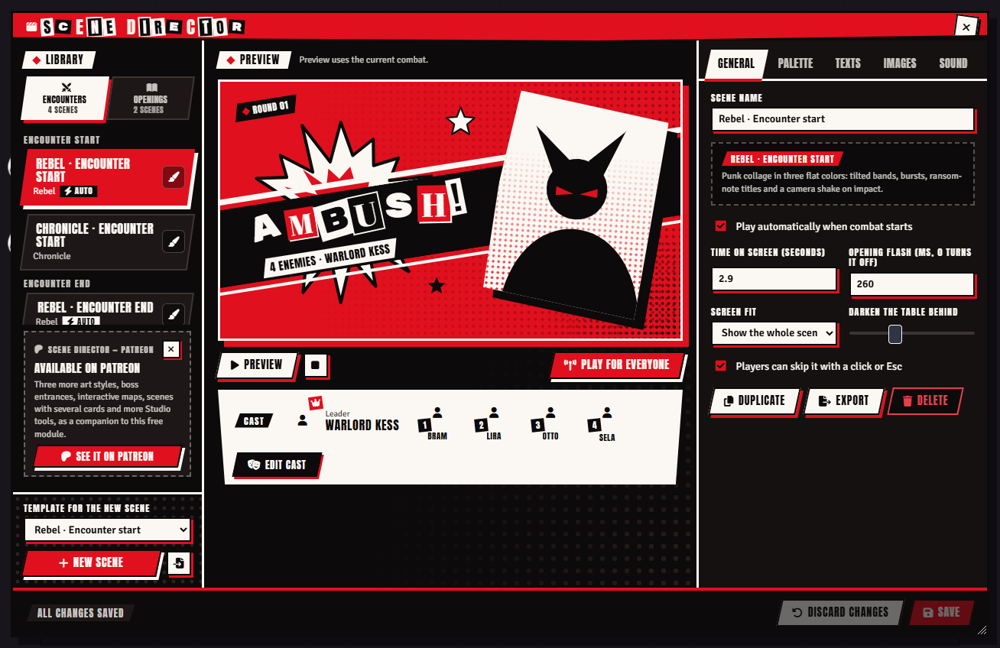

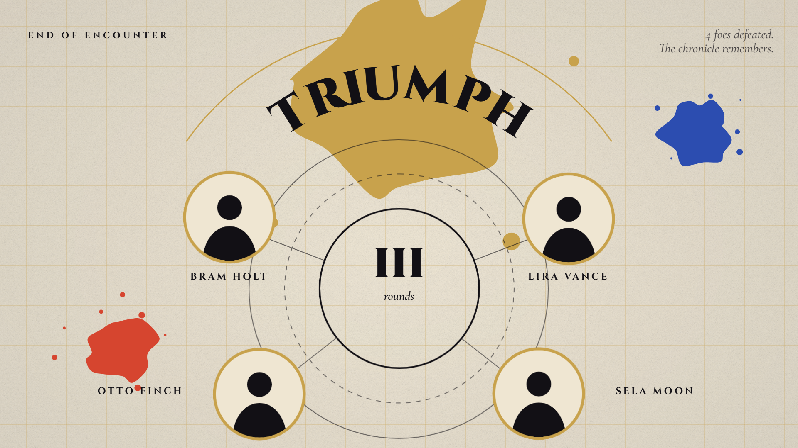

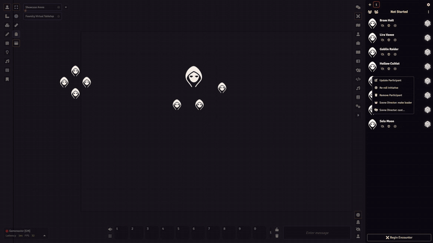

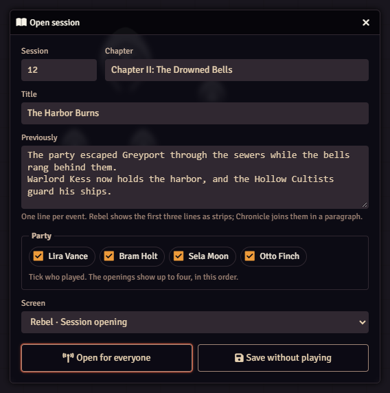

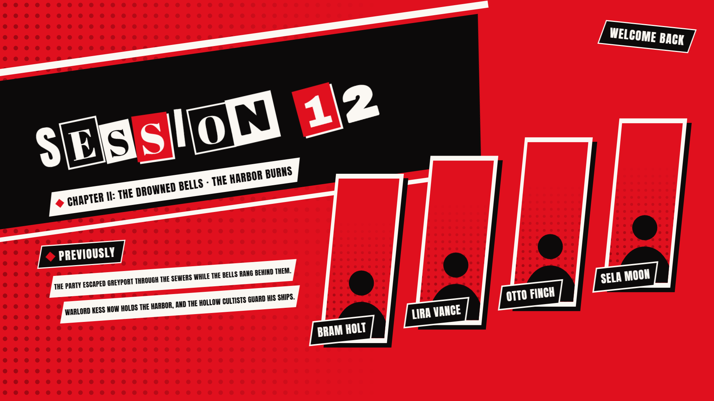

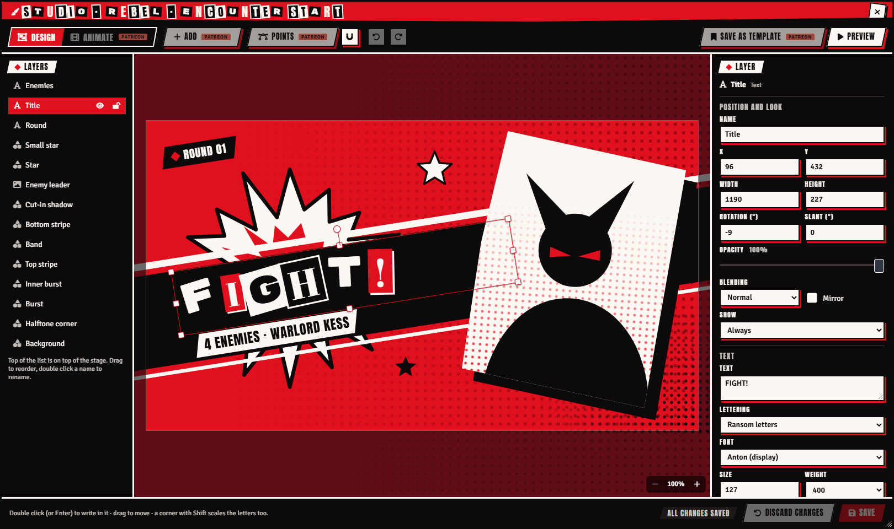

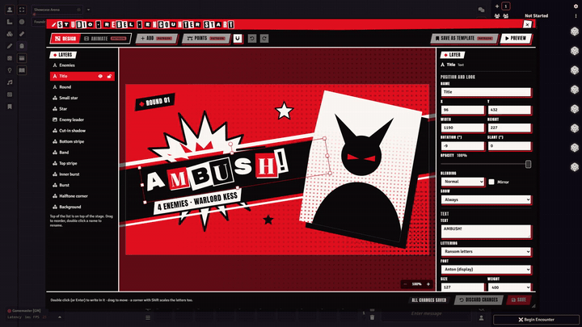

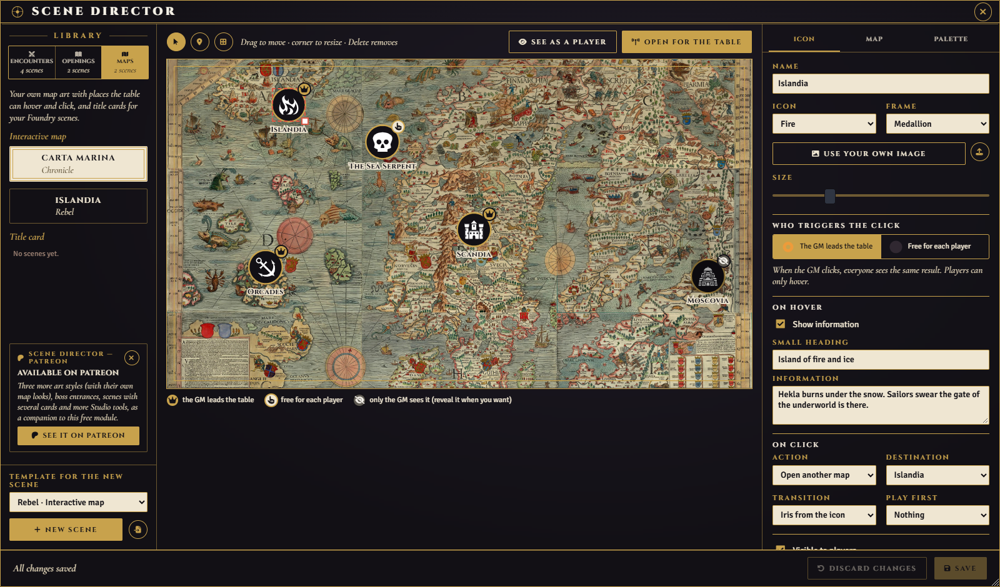

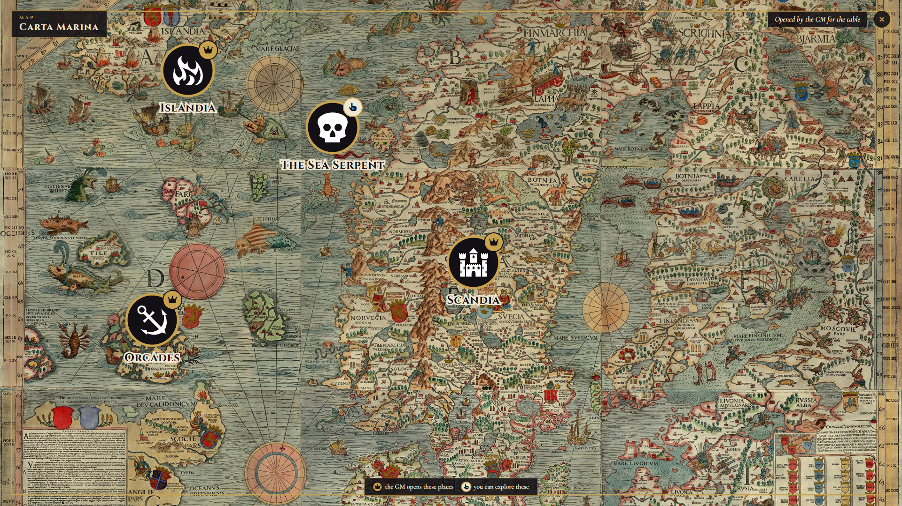

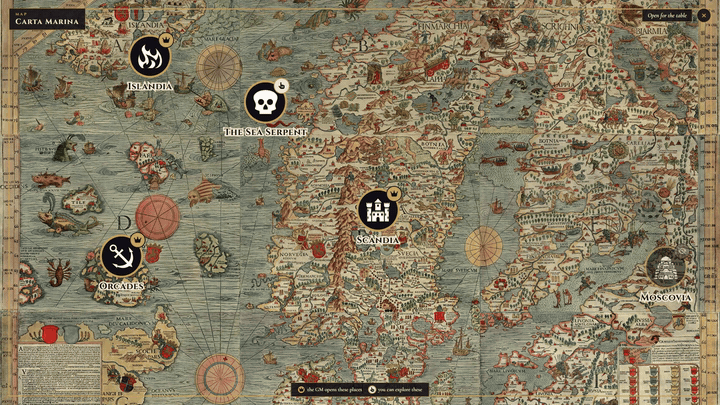

## Editions

- **Free:** the public package published here, complete on its own.
- **Patreon:** a separate companion module for Patreon members that uses the Free module as its required base. It adds three more art styles (each with its own look for maps and title cards), boss entrances, scenes with several cards, and Studio tools to add layers, bend shapes with curves, animate on a timeline and save templates. It is not distributed here.

Issues for the distributed module can be reported in this repository.

## Release integrity

Each release includes:

- `module.json`
- `scene-director-VERSION.zip`
- `scene-director-VERSION.zip.sha256`

The checksum can be used to verify that the downloaded ZIP matches the validated build.

## Credits and license

MIT. The bundled fonts (Anton, Archivo Black, Abril Fatface, Rubik Mono One, Cinzel, Cormorant Garamond) are under the SIL Open Font License. The screenshots show the module's own screens and built-in silhouettes. The map in the screenshots is the Carta Marina by Olaus Magnus (1539), in the public domain.
